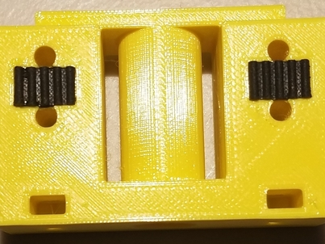
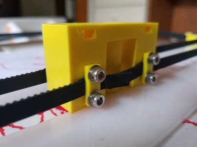
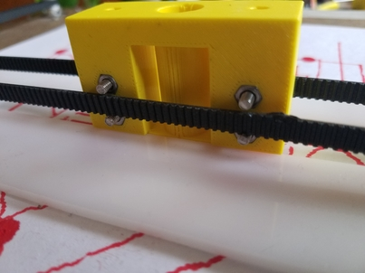

<iframe src="https://www.youtube.com/embed/vSqIZIaWzNs"
    width="560"
    height="315"
    frameborder="0"
    allowfullscreen>
</iframe>

This drawing robot incorporates an H-Bot gantry in order to move a writing instrument across a paper sheet using only two stepper motors.

# Why use an H-Bot?

A [cartesian coordinate robot](https://en.wikipedia.org/wiki/Cartesian_coordinate_robot) normally uses 3 motors to move an end effector across an x-y plane. This can be seen on machines like the MakerBot 3D printer and the desktop version of the Shopbot.

The H-Bot gantry design allows for the same x-y movement to be achieved using only 2 stepper motors. This makes the design advantageous for large-scale deployment in manufacturing, potentially lowering assembly costs, but more importantly it allows for the moving axes to be freed of carrying the weight of one of the stepper motors. Note that all motors of the drawing robot are immobile and anchored at the base - this is not something you would normally see on an x-y machine!

## How it works

Movement on the x-y plane is completely dictated by whether the two stepper motors turn in the same direction, or rotate opposite of each other.

The left motor turning clockwise and the right motor turning counter-clockwise, for example, causes increased tension on the bottom of the x-axis and relaxed tension above the x-axis. This causes a net effect of downward motion.

If both motors are turning clockwise, this causes tension on the left side of the end effector to increase, while the tension on the right side relaxes. This causes a net effect of the end effector moving to the left.

A more rigorous mathematical model of an H-Bot's movement can be found [here](https://www.icvr.ethz.ch/ConfiguratorJM/publications/MODELING_A_132687166151936/3314_mod.pdf).

The crisscrossing of the drive belt is not necessary for the H-Bot design, though it greatly stabilizes the wobbliness of the x-axis.

# Hardware

## Circuits

* [ATSAMD11 Breakout Board](https://roberthart56.github.io/SCFAB/SC_lab/Electronics/Microcontrollers/ATSAMD11/Advanced_circuits_board/index.html)

* [ATSAMD11 H-Brige Boards](https://roberthart56.github.io/SCFAB/SC_lab/Output_Devices/SAMD11_stepper/index.html)

## 3D-printed hardware

<html>
    <head>
        <title>Roller</title>
    </head>

    <body>
        <div id="stl_cont" style="width:50%;height:200px;margin:0 auto;"></div>

        <script src="stl_viewer.min.js"></script>        
        <script>
            var stl_viewer=new StlViewer
            (
                document.getElementById("stl_cont"),
                {
                    zoom:50,
                    bgcolor:"white",
                    models:
                    [
                        {filename:"roller.stl", color:"#ffff00", display:"smooth", rotationx:0.5, rotationy:0.5, rotationz:0.5, animation:{delta:{rotationx:1, msec:1000, loop:true}}}

                    ]
                }
            );
        </script>

    </body>
</html>

<html>
    <head>
        <title>Pen Holder</title>
    </head>

    <body>
        <div id="stl_cont" style="width:50%;height:200px;margin:0 auto;"></div>

        <script src="stl_viewer.min.js"></script>        
        <script>
            var stl_viewer=new StlViewer
            (
                document.getElementById("stl_cont"),
                {
                    zoom:70,
                    bgcolor:"white",
                    models:
                    [
                        {filename:"penholder1.stl", color:"#ffff00", display:"flat", rotationx:0.5, rotationy:0.5, rotationz:0.5, animation:{delta:{rotationx:1, msec:1000, loop:true}}}

                    ]
                }
            );
        </script>

    </body>
</html>

<html>
    <head>
        <title>Footpad</title>
    </head>

    <body>
        <div id="stl_cont" style="width:50%;height:200px;margin:0 auto;"></div>

        <script src="stl_viewer.min.js"></script>        
        <script>
            var stl_viewer=new StlViewer
            (
                document.getElementById("stl_cont"),
                {
                    zoom:70,
                    bgcolor:"white",
                    models:
                    [
                        {filename:"footpad.stl", color:"yellow", display:"flat", rotationx:0.5, rotationy:0.5, rotationz:0.5, animation:{delta:{rotationx:1, msec:1000, loop:true}}}

                    ]
                }
            );
        </script>

    </body>
</html>

### Rollers

The rollers used for this robot were designed by Jake Read for the machine design portion of MIT's How to Make Almost Anything class. More information can be found [here](https://gitlab.cba.mit.edu/jakeread/machineweek-2019). The .stl file for the roller itself can be downloaded [here](https://kem406.github.io/hbot/roller.stl).

### End effector

The end effector was designed to hold a pen-sized marker which fits through the shaft. Two small rectangle-shaped reliefs were incorporated into the right-hand and left-hand sides of the end effector—these are designed to snugly contain (with a small application of superglue) a small cut-off portion of the drive belt.

[](https://kem406.github.io/hbot/ee1b.jpg)

These embedded bits of drive belt can then act as the "teeth" that holds the main drive belt in place.

[](https://kem406.github.io/hbot/ee2b.jpg)

With a 3d-printed fastener (.stl can be downloaded [here](https://kem406.github.io/hbot/fastener.stl)) and some M3 screws and washers, the main drive belt can be fastened on top of the "teeth."

[](https://kem406.github.io/hbot/ee3b.jpg)

The end effector was designed to allow two M3 nuts to be embedded snugly in place for this purpose. Two more M3 nuts can be fitted inside two slots towards the top of the end effector; this allows for future additions (such as a solenoid) to be bolted on top.

The .stl file for the end effector can be downloaded [here](https://kem406.github.io/hbot/penholder1.stl).

### Footpads

These hourglass-shaped footpads are nothing special and exist entirely to support the back end of the robot. The .stl file for the footpads can be downloaded [here](https://kem406.github.io/hbot/footpad.stl).

## Miscellaneous hardware (non-exhaustive)

* Fiberglass board
* M3 hardware
* Drive belt
* [Unipolar stepper motors](https://www.jameco.com/z/42BYGH404-R-Unipolar-Stepper-Motor-12VDC-400mA_238538.html)
* 12-volt power supply


# Software

All of the following programming was done with the Arduino IDE with the board parameter set to "Generic D11C14A."

## Main break-out board code

```

/*
 * xy_sketcher.ino  Rob Hart 1/8/20. Modified by Ken Michalek 4/26/20. Code to create byte
 *packets for stepper motor boards to control an h-bot drawing machine as an "etch-a-sketch"
 */

int current_x = 0;    //calculated on the basis of steps sent.
int current_y = 0;    //calculated on the basis of steps sent.

void setup() {
   Serial1.begin(230400);     //uses USART on rx/tx pins.
   Serial.begin(0);           //USB serial
}
/*
 * Function to send stepper motor bytes based on requested x and y increments.
 */
void step(int dx, int dy){
  int delta_1;
  int delta_2;
  uint8_t byte_1;
  uint8_t byte_2;
  uint8_t step_1_dir;
  uint8_t step_2_dir;

  delta_1=dx+dy;        //This is the increment for motor 1, defined this way for h-bot geometry
  delta_2 =dx-dy;       //This is the increment for motor 2, defined this way for h-bot geometry

  //add more motors, or add code to send a command to another board, such as an 'end effector'.

  if (delta_1 >= 0) step_1_dir = 1;   //determine sign of steps for 1
  else step_1_dir = 0;

  if (delta_2 >= 0) step_2_dir = 1;   //determine sign of steps for 2
  else step_2_dir = 0;

  byte_1 = 128 * step_1_dir + 16 + abs(delta_1);    //this packs direction, address and step number into one byte. address = 1
  byte_2 = 128 * step_2_dir+ 2*16 + abs(delta_2);   //this packs direction, address and step number into one byte. address = 2
  Serial1.write(byte_1);
  Serial1.write(byte_2);
}


void loop() {
  int input_x;      //reading of ADC
  int setpoint_x;   //derived from ADC reading
  int deficit_x;   // difference between setpoint and calculated x

  int input_y;      //reading of ADC
  int setpoint_y;   //derived from ADC reading
  int deficit_y;   // difference between setpoint and calculated x
  int f = 8;      //keep number of steps above this number; fine tune for noise reduction
  int g = 11;     //keep number of steps below this number; fine tune for noise reduction

/*
 *Check x potentiometer, and calculate needed steps to match pen with requested x.
 */
input_x = analogRead(2);
  setpoint_x = 1023 - input_x;
  deficit_x = setpoint_x - current_x;

/*
 *Keep number of steps less than g and more than f (for noise reduction).
 */
  if (deficit_x > g) deficit_x = g;
  if (deficit_x < -g) deficit_x = -g;
  if ((deficit_x <= f) & (deficit_x  >= -f)) deficit_x = 0;

/*
 *Check y potentiometer, and calculate needed steps to match pen with requested y.
 */
  input_y = analogRead(4);
  setpoint_y = 1023 - input_y;
  deficit_y = setpoint_y - current_y;

/*
 *Keep number of steps less than g and more than f (for noise reduction).
 */
  if (deficit_y > g) deficit_y = g;
  if (deficit_y < -g) deficit_y = -g;
  if ((deficit_y <= f) & (deficit_y  >= -f)) deficit_y = 0;

  step(deficit_x , deficit_y);          //step requested amounts
  current_x = current_x + deficit_x;    //update x
  current_y = current_y + deficit_y;    //update y

   delay(20);
   Serial.print(current_x);               //print out current values.
   Serial.print(", ");
   Serial.println(current_y);
  }
```

## Stepper motor board code

This code is given to both stepper motor boards. Note that it is important that one board's uint8_t address is set to 1 and the other is set to 2. This is because both boards are fed the same serial code, and this is the only way for the two motors to tell which part of the instructions they should be following (otherwise, they wouldn't be able to rotate in different directions when we want the robot to move up and down).

```
/*
Jan 7, 2020.  Rob Hart.  samd11_stepper_3
Program to drive stepper in response to one byte transferred into USART NO. 1.
MSB(7): direction.
6-4: address.
3-0: number of steps to take.
In this program, step time is fixed.

*/
int Aplus = 15;   //corresponds to h-bridge input pin +
int Aminus = 14;   //corresponds to h-bridge input pin -
int Bplus = 8;   //corresponds to h-bridge input pin +
int Bminus = 5;   //corresponds to h-bridge input pin -
int LED_G = 4;    //LEDs are attached to pins to give a visual indication of direction and step
int LED_R = 2;

int step_num = 1;
uint16_t step_count = 0;      //number of steps since program began.
uint8_t pulse_count = 0;     //The variable with range 0-3 that determines which motor state to
uint8_t rec_byte = 0;         //The byte received from USART
bool direction = true;        //True corresponds to incrementing pulse count.
//uint8_t address = 2;      //This value is unique to a given board. Ranges 0-7.
uint8_t address = 1;      //This value is unique to a given board. Ranges 0-7.

void setup() {
  Serial1.begin(230400);
  SerialUSB.begin(0);
  pinMode(Aplus, OUTPUT);
  pinMode(Aminus, OUTPUT);
  pinMode(Bplus, OUTPUT);
  pinMode(Bminus, OUTPUT);
  pinMode(LED_G, OUTPUT);
  pinMode(LED_R, OUTPUT);

}
/*
The following functions energise the windings, in order defined as positive stepping
*/
void pulse_0(){
  digitalWrite(Aplus,HIGH);
  digitalWrite(Bplus,HIGH);
}

void pulse_1(){
  digitalWrite(Aminus,HIGH);
  digitalWrite(Bplus,HIGH);
}

void pulse_2(){
  digitalWrite(Aminus,HIGH);
  digitalWrite(Bminus,HIGH);
}

void pulse_3(){
  digitalWrite(Aplus,HIGH);
  digitalWrite(Bminus,HIGH);
}
/*
The following function turns off all windings.
*/
void all_off() {
  digitalWrite(Aplus,LOW);
  digitalWrite(Aminus,LOW);
  digitalWrite(Bplus,LOW);
  digitalWrite(Bminus,LOW);
}

void loop() {

  while (!Serial1.available()){       //wait until serial is available.
  }

  rec_byte =  Serial1.read();


  if ((rec_byte & 0b01110000) >> 4 == address){     //Bitwise detection of address using three-digit mask and shifting.
                                                    //If address is detected, step the motor. Otherwise, go back and wait for another byte.
    digitalWrite(LED_G, HIGH);                      //Green LED indicates start of stepping.

    direction = rec_byte & 0b10000000;        //set the boolean direction to be true or false using only the most significant bit.
    if (direction) digitalWrite(LED_R, HIGH);     //use LED as a visual indicator of + direction.
    else digitalWrite(LED_R, LOW);

    step_num = rec_byte & 0b00001111;      //strip off lower half-byte

    /*
    The following loop steps the motor for 'step_num' steps.
    */
    for(int i=0; i<step_num; i++){

      if (direction) step_count++;
      else step_count--;

      pulse_count = step_count%4;       //use the modulo function to keep track of which motor state to use.

      SerialUSB.println(step_count);    //print out overall step count.

      all_off();
      delayMicroseconds(10);

      if (pulse_count == 0) pulse_0();
      if (pulse_count == 1) pulse_1();
      if (pulse_count == 2) pulse_2();
      if (pulse_count == 3) pulse_3();

      delayMicroseconds(5000);      //microseconds.  This, together with unknown overhead, defines the step time.
    }
    digitalWrite(LED_G, LOW);    //done with stepping.
      }


 }
```
